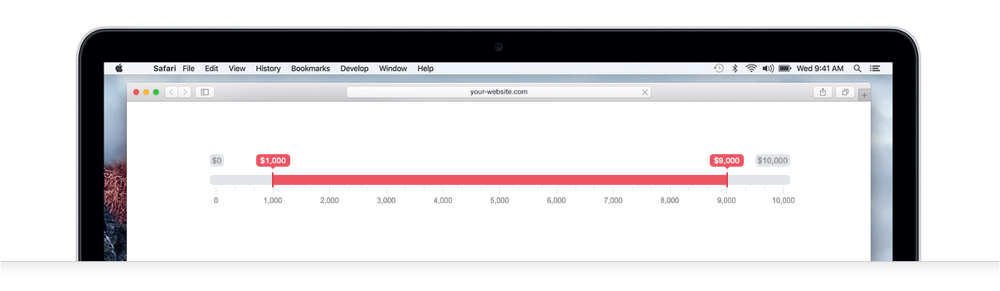

ion.RangeSlider — flexible and responsive range slider with skins, touch support, and a grid of values.

***

* Version: 2.3.2
* [Project page and demos](http://ionden.com/a/plugins/ion.rangeSlider/)
* [Download ZIP](https://github.com/IonDen/ion.rangeSlider/archive/2.3.2.zip)
* [Support on GitHub Sponsors](https://github.com/sponsors/IonDen)

## Features

* 6 built-in skins (flat, big, modern, round, sharp, square)
* Single handle or double handle (range) mode
* Negative and fractional values, custom step
* Custom values array (numbers or strings)
* Value grid with snapping
* Prefix and postfix for displayed values ($100, 100k, etc.)
* Large number formatting (10000000 → 10 000 000)
* Reads from and writes to a native `<input>` element — works in any HTML form
* Initialization via JavaScript or `data-*` attributes
* Public methods: update, reset, destroy
* Callbacks: onStart, onChange, onFinish, onUpdate
* Keyboard navigation
* Touch device support
* Works in Internet Explorer 8+ and all modern browsers
* MIT license



## Demos

* [Basic demo](http://ionden.com/a/plugins/ion.rangeSlider/demo.html)
* [Advanced demo](http://ionden.com/a/plugins/ion.rangeSlider/demo_advanced.html)
* [Interactions demo](http://ionden.com/a/plugins/ion.rangeSlider/demo_interactions.html)


## Dependencies

* [jQuery 1.8+](http://jquery.com/). The browser suite has been run against every version in test/browser/matrix.mjs, from 1.8.3 to 4.0.0 including the 3.x and 4.x slim builds; the boundary versions run on every pull request and the full matrix runs weekly. The plugin's minified files are tested under jQuery 3.7.1 on every pull request.


## Install

npm:
```
npm install ion-rangeslider
```

Yarn:
```
yarn add ion-rangeslider
```


## CDN

Use [cdnjs](https://cdnjs.com/libraries/ion-rangeslider) or [jsDelivr](https://www.jsdelivr.com/package/npm/ion-rangeslider).

```html
<!-- CSS -->
<link rel="stylesheet" href="https://cdnjs.cloudflare.com/ajax/libs/ion-rangeslider/2.3.2/css/ion.rangeSlider.min.css"/>

<!-- jQuery -->
<script src="https://cdnjs.cloudflare.com/ajax/libs/jquery/3.3.1/jquery.min.js"></script>

<!-- Plugin -->
<script src="https://cdnjs.cloudflare.com/ajax/libs/ion-rangeslider/2.3.2/js/ion.rangeSlider.min.js"></script>
```


## Usage

The slider replaces a native text input:

```html
<input type="text" id="example_id" name="example_name" value="" />
```

Initialize it with:

```javascript
$("#example_id").ionRangeSlider();
```


## Full example

```javascript
$("#example").ionRangeSlider({
    skin: "big",
    min: 0,
    max: 10000,
    from: 1000,
    to: 9000,
    type: 'double',
    prefix: "$",
    grid: true,
    grid_num: 10
});
```

Or use `data-*` attributes on the input:

```html
<input type="text" id="example"
    data-min="0"
    data-max="10000"
    data-from="1000"
    data-to="9000"
    data-type="double"
    data-prefix="$"
    data-grid="true"
    data-grid-num="10"
/>
```


## Settings

| Option | Data-Attr | Defaults | Type | Description |
| --- | --- | --- | --- | --- |
| `skin` | `data-skin` | `flat` | string | UI skin (flat, big, modern, round, sharp, square) |
| `type` | `data-type` | `single` | string | `single` for one handle, `double` for two handles |
| `min` | `data-min` | `10` | number | Minimum value |
| `max` | `data-max` | `100` | number | Maximum value |
| `from` | `data-from` | `min` | number | Start position for left handle (or single handle) |
| `to` | `data-to` | `max` | number | Start position for right handle |
| `step` | `data-step` | `1` | number | Step size. Always > 0. Can be fractional |
| `min_interval` | `data-min-interval` | `-` | number | Minimum range between handles. Double type only |
| `max_interval` | `data-max-interval` | `-` | number | Maximum range between handles. Double type only |
| `drag_interval` | `data-drag-interval` | `false` | boolean | Allow dragging the whole range. Double type only |
| `values` | `data-values` | `[]` | array | Custom array of possible values (numbers or strings). When set, min, max and step are ignored |
| `from_fixed` | `data-from-fixed` | `false` | boolean | Fix position of left (or single) handle |
| `from_min` | `data-from-min` | `min` | number | Minimum limit for left (or single) handle |
| `from_max` | `data-from-max` | `max` | number | Maximum limit for left (or single) handle |
| `from_shadow` | `data-from-shadow` | `false` | boolean | Highlight the limits for left handle |
| `to_fixed` | `data-to-fixed` | `false` | boolean | Fix position of right handle |
| `to_min` | `data-to-min` | `min` | number | Minimum limit for right handle |
| `to_max` | `data-to-max` | `max` | number | Maximum limit for right handle |
| `to_shadow` | `data-to-shadow` | `false` | boolean | Highlight the limits for right handle |
| `prettify_enabled` | `data-prettify-enabled` | `true` | boolean | Format long numbers: 10000000 → 10 000 000 |
| `prettify_separator` | `data-prettify-separator` | ` ` | string | Separator for long numbers: 10000000 → 10,000,000 |
| `prettify` | `-` | `null` | function | Custom formatting function. Receives a number, returns a string |
| `force_edges` | `data-force-edges` | `false` | boolean | Keep handles and tooltips inside the container |
| `keyboard` | `data-keyboard` | `true` | boolean | Keyboard controls. Left: ←, ↓, A, S. Right: →, ↑, W, D |
| `grid` | `data-grid` | `false` | boolean | Show grid of values above the slider |
| `grid_margin` | `data-grid-margin` | `true` | boolean | Add left and right grid gaps |
| `grid_num` | `data-grid-num` | `4` | number | Number of grid units |
| `grid_snap` | `data-grid-snap` | `false` | boolean | Snap grid to step. When active, grid_num is not used. Max 50 steps |
| `hide_min_max` | `data-hide-min-max` | `false` | boolean | Hide min and max labels |
| `hide_from_to` | `data-hide-from-to` | `false` | boolean | Hide from and to labels |
| `prefix` | `data-prefix` | `` | string | Prefix for values: **$**100 |
| `postfix` | `data-postfix` | `` | string | Postfix for values: 100**k** |
| `max_postfix` | `data-max-postfix` | `` | string | Postfix for the maximum value only: 0 — 100**+** |
| `decorate_both` | `data-decorate-both` | `true` | boolean | How to format close values in double mode: **$10k — $100k** vs **$10 — 100k** |
| `values_separator` | `data-values-separator` | ` — ` | string | Separator between from and to labels in double mode |
| `input_values_separator` | `data-input-values-separator` | `;` | string | Separator in the input value for double mode: `<input value="25;42">` |
| `disable` | `data-disable` | `false` | boolean | Disable the slider. Input is also disabled and invisible to forms |
| `block` | `data-block` | `false` | boolean | Block the slider but keep the input enabled. Value is still submitted with the form |
| `extra_classes` | `data-extra-classes` | `—` | string | Extra CSS classes for the slider container |
| `scope` | `-` | `null` | object | Scope for callbacks |
| `onStart` | `-` | `null` | function | Called on slider start |
| `onChange` | `-` | `null` | function | Called on each value change |
| `onFinish` | `-` | `null` | function | Called when the user releases a handle |
| `onUpdate` | `-` | `null` | function | Called when slider is modified by `update` or `reset` |


## Callback data

All callbacks receive an object as the first argument:

```javascript
{
    "input": object,            // jQuery reference to the input
    "slider": object,           // jQuery reference to the slider container
    "min": 1000,                // MIN value
    "max": 100000,              // MAX value
    "from": 10000,              // FROM value
    "from_percent": 10,         // FROM value in percent
    "from_value": 0,            // FROM index in values array (if used)
    "to": 90000,                // TO value
    "to_percent": 90,           // TO value in percent
    "to_value": 0,              // TO index in values array (if used)
    "min_pretty": "1 000",      // MIN formatted (if prettify is on)
    "max_pretty": "100 000",    // MAX formatted
    "from_pretty": "10 000",    // FROM formatted
    "to_pretty": "90 000"       // TO formatted
}
```


## Public methods

Save the slider instance, then call methods on it:

```javascript
// Create
$("#range").ionRangeSlider({
    type: "double",
    min: 0,
    max: 1000,
    from: 200,
    to: 500,
    grid: true
});

// Get the instance
var slider = $("#range").data("ionRangeSlider");

// Update values
slider.update({
    from: 300,
    to: 400
});

// Reset to initial values
slider.reset();

// Remove the slider and restore the original input
slider.destroy();
```


## Advanced examples

[Experiments playground on JSFiddle](https://jsfiddle.net/IonDen/uqs7njp9/)

* [Custom marks on slider](https://jsfiddle.net/IonDen/tdvxs3zL/)
* [1 handle bound to 1 input](https://jsfiddle.net/IonDen/khngpw3m/)
* [2 handles bound to 2 inputs](https://jsfiddle.net/IonDen/avcm6wpj/)
* [2 sliders connected to each other](https://jsfiddle.net/IonDen/1hnvxsg5/)
* [2 dependent sliders](https://jsfiddle.net/IonDen/f1t6qpx0/)
* [1st slider enables/disables 2nd slider](https://jsfiddle.net/IonDen/kqwm1294/)
* [Non-linear slider](https://jsfiddle.net/IonDen/5f2730ds/)
* [Plus and minus buttons](https://jsfiddle.net/IonDen/e9as5k2m/)
* [Calculating sum](https://jsfiddle.net/IonDen/dfcmryn2/)
* [Adding a second range on 1 slider](https://jsfiddle.net/IonDen/ckwrqv75/)
* [Live editing of min and max values](https://jsfiddle.net/IonDen/wgfv76je/)
* [Prettify and transform values at the same time](https://jsfiddle.net/IonDen/kc0tzreu/)
* [Rendering money value n.nn](https://jsfiddle.net/IonDen/a0rghmd7/)
* [Changing step live](https://jsfiddle.net/IonDen/5ptjgm6h/)
* [Toggle slider](https://jsfiddle.net/IonDen/7m4otxwp/)
* [Skip some values](https://jsfiddle.net/IonDen/bqyw1e7k/)
* [Values array + prettify](https://jsfiddle.net/IonDen/p9gu71sL/)


## [Update history](history.md)

***

#### Support the project

* [GitHub Sponsors](https://github.com/sponsors/IonDen)
* [Buy me a coffee](https://www.buymeacoffee.com/ionden)
